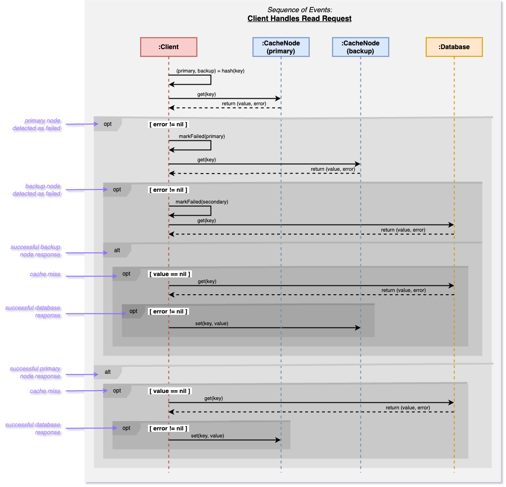

# A Study of Cache-Database Interactions

## Introduction and Background

In read-heavy systems that are backed by a central database, it is common strategy to use a distributed caching system as a buffer to significantly reduce the load on the database. This allows for handling a workload much greater than the capacity of the underlying database, as the cache fulfills a large percentage of the requests. 

## Problem Statement

However, when the system operates at or close to its maximum capacity, even a temporary failure of one or more cache nodes could overwhelm the database, creating a bottleneck effect for the other nodes who are prevented from acquiring fresh data upon a cache-miss. As the overall hit rate diminishes, this leads to a cascade of failures throughout the system as more requests go unmet. Thus the stability of the entire system depends on the reliability of each individual node; should even one fail, it could trigger a feedback loop that jeopardizes the system's overall functionality.

## Proposed Solution

Our project aims to address this critical vulnerability. We propose a solution that introduces a dual-layered hashing mechanism to assign each key to both a primary and a secondary (backup) node. Each node keeps track of it's hottest keys along with which backup node each key is hashed to. Nodes are tasked with periodically synchronizing their hottest keys with their corresponding backup nodes. This selective replication focuses on maintaining the most critical data readily available in the backup node's cache, thus providing a rapid failover solution if the primary node becomes unresponsive. The client keeps track of the status of each node and when one is detected in a failed state, This approach aims to maintain overall operational integrity and prevent the cascade of failures that compromise system stability.

## Project Description

This project models a scenario where client requests are managed through multiple cache nodes placed ahead of a central database. Client-side hashing directs each request to a cache node; if data is not found (a cache miss), the request then goes to the database. 

## System Configuration
- 5 servers - one for the database and four for cache instances.
- The database runs in its own container using 2 cores.
- Each cache instance uses 3 cores, totaling 12 cores for all cache instances.
- Aims for 90% of requests to be served by the cache and 10% by the database.

## Project Structure

The project consists of multiple modules, each with its own functionality:

- **Cache Node**: Manages caching operations (uses Memcache)
- **Database**: Manages database operations.
- **Benchmark**: Responsible for distributing requests between cache and database layers and uses Alibaba traces for performance analysis.

## (Old) Benchmarking with Trace Files
- Trace files are located in the `/usr/local/share/datasets/cmu-cache-datasets/alibabaBlock` directory on the `ccl5` remote host and are used by the benchmark module to simulate realistic workload patterns.
- The benchmark container will run on this remote host and will have the `alibabaBlock` directory mounted to `/app/traces` inside the Docker container.

## Simulating a Cache Failure
- Intentionally disable one cache instance to observe the effects on the database. The timing of the failure and recovery can be configured in the property file.
- Study the system's behavior when the cache instance is reinstated.

## Getting Started

### Installation

To build and run the Docker containers for each module, follow these steps:

#### Building the Docker Image

Navigate to the project root and build the Docker image for each module. For example, to build the benchmark module:

`docker build --platform=linux/amd64 -f benchmark/Dockerfile -t dockerusername/benchmark:benchmark .`

Repeat similar steps for the cache and database modules.

#### (Old) Running the Docker Container with Trace File Access

To run the benchmark module with access to the trace files, use the following command:

`docker run -v /usr/local/share/datasets/cmu-cache-datasets/alibabaBlock:/app/traces -it --rm dockerusername/benchmark:benchmark`

This command mounts the `alibabaBlock` directory containing the trace files into the container at `/app/traces`.

### Usage

- The benchmark module will process the trace files located in `/app/traces` inside the Docker container.
- Make sure the benchmark application logic refers to this path when accessing the trace files.

## Authors

- **Hannah Marsh** - _Initial work_ - [hrm1065](https://gitlab.cs.unh.edu/hrm1065)
