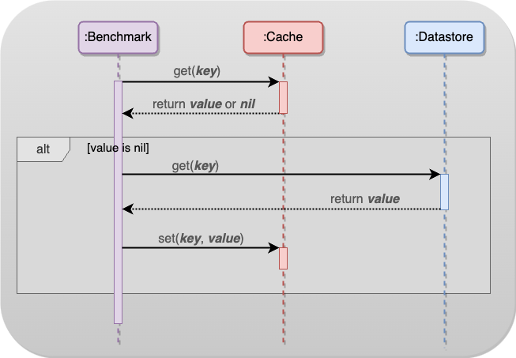

# Benchmarking a Distributed Cache-Database Interaction System
  

## Introduction  

This project focuses on developing a distributed cache benchmarking system designed to evaluate the performance and 
resilience of a distributed cache setup.  
  
The system is composed of multiple cache nodes, a benchmark tool, and mechanisms for simulating node failures and monitoring performance metrics.
It interfaces with Apache Cassandra ([gocql](https://github.com/gocql/gocql)) as a datastore and uses [Gocache](https://github.com/eko/gocache) as the
caching layer.

## System Configuration   

- 5 servers - one for the database and four for cache instances.
- The database runs in its own container using 2 cores.
- Each cache instance uses 3 cores, totaling 12 cores for all cache instances.
- Aims for 90% of requests to be served by the cache and 10% by the database.

## Components and Interactions 
  
  
[](https://viewer.diagrams.net/?tags=%7B%7D&highlight=0000ff&edit=_blank&layers=1&nav=1&title=new1.drawio#R7VtRc6M2EP41nmkfnAFhwH6MnaR9uM5kLp3eTN8UkDENRq6Q4%2Fh%2BfVcgAUJAnATcZMbxXM5aSQtov%2F12VyITZ7V9%2BY3h3eYPGpJkgqzwZeLcTBCy3TmC%2F4TkWEh85BeCiMVhIbIqwUP8k8iZSrqPQ5JJWSHilCY83unCgKYpCbgmw4zRgz5sTZNQE%2BxwRLTbEIKHACfEGPYjDvmmkCLLqg3%2FncTRhjd7tliNloJsg0N6qImc24mzYpTy4tv2ZUUSsXr6wtx19JZ3xkjKT5lwf%2BDff3jPz3echtfpX7dRsvp7iuaFmmec7OUjy7vlR7UGjO7TkAgt9sRZHjYxJw87HIjeA1gdZBu%2BTWT3mqZcmtH2oJ1xRp%2FIiiaUgSilKRGD4iR5kBfAe06lSI2aIOc2%2F4A8YjiM4QlrfauF%2BAjdakXFheVzEMbJS%2BcK2eW6A2IJ3RLOjjBETpjarlfMkWh1itahsrznSq2bmtFnrjQxlmiLStWVPeCLNMkbzOO9bh2ShtcC6NAKEpxlcaAbpLKe1TAPys2DmRLMoQ3aaq1gz55LwzcsROzQJb5hYeix8p%2ByR%2FkNKo1EwqjpXg0TwRPSPQtIz9IoNsAsIrxvXIfNa0ZV5qvbVMkYSTCPn%2FX7bbOzvMI9jeFJSkjZvqshChTrKornlLPq3ttQVE48NhQrRcVCGIoAG%2FhYG7YTA7LuG140LmN5DRAXCitIl0v6fpT7BsrhSX6ZIC8BYyxj%2BBLxHDyF4FEJnshRyeC6j81xICvn%2Fmr6DYDwG36EeKW5C07iKBW%2BBIAkAOilYJQYAsK17NjGYSh0LBnJ4p%2F4Mdcn0C5XFpS7y4l708KFibjcEgdPUe6UDVIseikLCWvSJdX4z%2FXFp4%2FyZDSUN1cPbpWfdfNNJz9aV7YzayPIDzrJ1PY1rdJnKxV0vc4IbwBxEOjZroE9nHADLBBpduLrfpvcMbwlr8fBHA2E3T6TAhRN8hV4UBTkCWOW5OOI6dkh3iY4JXc66d4sxKce%2Bqye2Gkws5f%2FmIgqfoYKok6TqTwjjLqLhUm59mI%2BUhi1zTDqXEOsCzZbzJ76rP0tXpMkzr1wR1gMtyNI4SaR4vtK9hogwCc5hilMtkNGd3%2Bq4GXlA5IE77K4YhRGIABn4FffBdUoKd1zcelVmfEW5MPAoClYHMe5nQjO%2BIFkgvtScrgFslMJ18QXDPnvXuSdKsKXbVgX4IpVJVDpgz7Cb6O3kxOEhec7WMyIRMIin0BL5vSUsyuP%2BBhOXZ10HMtAqW21JAYze6xkTynuy%2FaaDFPGm6UwW%2F2fK2IQWLLosWs906rL7pxkt07Kw1rdEQB2GxrRFCd1V2iFaJGgPAjfykzn%2BpL4PQmG3YzUic2ZzqAq1dOgaSLTsfyxkOm0pk%2FKIjJNKasFyyg7Kph8o3QnAfwP4fwoDSCrwI5C8vVKJcTZpuQL0bjHHLCY5hJktbNIw%2BDreUCCoLeiGbB%2BQafWL1Y7VN6Wc721DLAtRw%2FiszPUAfbMIEBG%2BB6sKBLYRvJvlAfFrJbcv71GsMC4p6hN4%2BR0pZ%2B9xjhfJVFQRnf0ta4c1xuofHD0XZupjc5VPqC2xHKFgw25JJWjBOVujn6cu2If7vyJpO2i9yWS44Xrlnrnkkh%2BZsy%2BP5FEb0okzUq8LZGcjVXhqP2iCzAvwNSAieanIRONRZktwHSubzAHG1F2Cebj4C%2FEZL5uxZ8XzMnj%2Bn8I5k7zBPDkXSFnrGDekmNeOPMzY%2Fb9nNlfMzU4016Yx9Ot0dwdC5ktp9OuKsOtOINfonh2bwy8wsJwYwlr7wY0RB27Qq5qS8VWXyVt1Nz9hfIAVNLcYLb9xWlcomrs4Q3mG5b4ZNt4n%2B0dA2mJ1zfpOrKdcTfpkK2fxqrz2HE36cw3huqn9d0bafppfe9G2hc4rT%2FjTprfTzPWFYJsfTLITlpjK%2BOMB%2FGlT34VbupOBHq46YRjiiHp63OfMSAV%2FBR9ef749KWy57OcMVxITHfvvjeLkOcNwmG2o6Nq2qzMRuSw2RfjsC%2BTX6GOymgoghocCeZrZZmeJNVAompQYcqpFF%2BLK3BghqAgF1Wmvvbm40qnsY9dpcl2l%2Fys2%2Bt7qA3NvYHSM7RoUNsAB53QrP4GoRhe%2FSmHc%2Fsf)
- [**Benchmark**](#benchmark-tool-): Simulates client requests and distributes them between the cache and database layers.
- [**Cache**](#cache-node): An instance of a cache server.
- [**Datastore**](#setting-up-the-database): The ultimate source of data for the system.


## Setting Up the Database

Setup Apache Cassandra database on `ccl5.cs.unh.edu`
- Install it on the server, if not already done.
- Configure it to allow connections from the cache nodes and benchmark:
  - Locate the cassandra.yaml configuration file, (`/etc/cassandra/` or `/opt/cassandra/conf/`). 
    - Modify `rpc_address` or `listen_address` to allow connections from other machines, setting it to `132.177.10.85` (or `0.0.0.0` for all interfaces).
    - Open the necessary ports (default is 9042 for CQL) on the server's firewall to allow incoming connections.
    - Restart the Cassandra service to apply the changes.
- Create the necessary keyspaces and tables:
  - Access the Cassandra query shell by running `cqlsh` on the command line.
    - Use a CQL statement to create a keyspace:
        ```sql
        CREATE KEYSPACE mykeyspace WITH replication = {'class': 'SimpleStrategy', 'replication_factor': 1};
        ```

## Benchmark Tool  

This benchmark tool is designed to simulate a realistic load on a distributed cache system, measuring its performance and 
resilience under various conditions.   
It is tailored for scenarios involving read-heavy workloads and dynamic cache recovery.

### System Architecture  

The benchmark tool interacts with a distributed cache setup comprising multiple cache nodes. It can operate in both local
and remote configurations. Cache nodes are simulated using `gocache`, a Go-based in-memory cache.

### Features  

- Generates a large number of cache read and write requests to test cache performance under load.
- Simulates failures in cache nodes to analyze the system's failover mechanisms and resilience.
- Integrates with Prometheus to track key metrics like read/write operations, cache hits and misses, operation latency, and throughput.
- Allows adjustment of parameters such as the number of requests, read/write ratios, and cache node details for flexible testing. 


### Key Components
- **`config_`:** 
  - Central configuration struct holding database connection details, cache node configurations, and other operational parameters.
- **Metrics Tracking:**
  - **Counters:** `readOpsCounter`, `writeOpsCounter`, `cacheHitsCounter`, `cacheMissesCounter` for tracking various operation counts.
  - **Histogram:** `opLatencyHistogram` for observing the latency of read/write operations.
  - **Gauge:** `throughputGauge` for measuring the operations per second, providing a dynamic view of the system's throughput.
- **Simulated Node Failures:** 
  - A routine that periodically triggers failures and recoveries in cache nodes to test the system's resilience.
- **Throughput Updater:** 
  - A background process that regularly updates the throughput gauge based on the number of successful operations.

  
### Request Generation and Distribution:

- To mimic real-world scenarios, the system employs various strategies for generating requests:
    - Zipf Distribution: For simulating access patterns where some keys are "hotter" than others.
    - Real Traces: Uses actual data to model request patterns.
- The workload primarily consists of read operations, with an initial warm-up stage to fill the database with data.
  

### Benchmarking with Trace Files
- Trace files are located in the `/usr/local/share/datasets/cmu-cache-datasets/alibabaBlock` directory on the `ccl5` remote host and are used by the benchmark module to simulate realistic workload patterns.
- The benchmark container will run on this remote host and will have the `alibabaBlock` directory mounted to `/app/traces` inside the Docker container.
  

### Usage

To run the benchmark:

1.  Configure the cache nodes and database settings in the `config.json` file.
2.  Execute the benchmark program using `go run benchmark.go`. Use flags `-l` for local testing and `-help` for usage instructions.
3.  The tool will start sending requests to the cache nodes, simulating read/write operations.
4.  Prometheus metrics can be accessed at `http://localhost:9100/metrics`.

### Prometheus Integration

The tool exposes various metrics in Prometheus format for easy integration with monitoring systems.  
It provides a detailed view of the cache system's performance, including latency and throughput under normal operation and simulated failure conditions.


* * *

## Cache Node
  
A cache node is an instance of a cache server, encapsulated within a wrapper that facilitates remote access.  
Each node operates potentially in a separate container, which can be hosted on the same or different machine.  
  
### Purpose 
  
These nodes serve as the fundamental units of the cache system, providing a straightforward interface for cache operations,
including setting and retrieving values, and simulating node failures/recoveries for testing.
  
### Functionality  

- Facilitates standard cache operations such as setting (`/set`) and getting (`/get`) values, using Gocache's in-memory store.
- Implements endpoints (`/fail` and `/recover`) to simulate node failures and recoveries.
- Uses a mutex (`failMutex`) to manage concurrent access to the cache's failure state, ensuring thread safety.

### Simulating Cache Failure  

Upon failure, a failed cache node can be restarted. However, it will be empty post-reboot, intentionally leaving the
database overloaded and the cache unfilled. This setup allows for the observation of how the system copes with cache node failures and recovers.
  
An endpoint has been added to the cache server so that, when triggered, it tells the server to stop responding to
regular cache requests. This way, we can simulate a failure without needing to shut down the process.
- `/fail`: When this endpoint is hit, the server changes its state to a "failed" mode where it does not respond to cache requests.
- `/recover`: clears the cache of any data from before failing and switches the server back to normal operation.

### Key Components  

- **Cache Initialization:**
  - **Gocache Client:** Creates an in-memory cache client with a default expiration time and cleanup interval.
  - **Cache Manager:** Initializes a cache manager using Gocache's store, which is central to all cache operations.
  - **HTTP Handlers:**
  - `setupHandlers`: Sets up routes for cache operations and failure simulation.
    - `set_` and `get_`: Handle HTTP requests for setting and retrieving values from the cache.
    - `fail_` and `recover_`: Enable simulation of cache node failures and recoveries.
- **Failure Simulation:**
  - `simulateFailure`: Checks and responds if the cache node is in a failed state.

### Usage  

1.  **Starting the cache node instance:**  
     - Run the cache node using `go run cache.go -id <cache_id> -port <port>`. Replace `<cache_id>` and `<port>` with appropriate values.
       - By default, the cache listens on port `1025`. Use the `-port` flag to change the listening port.  

2.  **Interacting with the cache:**
     - Use HTTP requests to interact with the cache:
       - `GET /get?key=<key>` to retrieve a value.
       - `POST /set?key=<key>&value=<value>` to set a value.  
     
3.  **Simulating failures:**
     - To simulate a failure, send a request to `GET /fail`.
     - To recover the cache, send a request to `GET /recover`.

## Running Docker

### Installation

To build and run the Docker containers for each module, follow these steps:

#### Building the Docker Image

Navigate to the project root and build the Docker image for each module. For example, to build the benchmark module:

`docker build --platform=linux/amd64 -f benchmark/Dockerfile -t hannahmarsh12/benchmark:benchmark .`

Repeat similar steps for the cache and database modules.


#### Running the Docker Container with Trace File Access

To run the benchmark module with access to the trace files, use the following command:

`docker run -v /usr/local/share/datasets/cmu-cache-datasets/alibabaBlock:/app/traces -it --rm hannahmarsh12/benchmark:benchmark`

This command mounts the `alibabaBlock` directory containing the trace files into the container at `/app/traces`.
  

### Usage

- The benchmark module will process the trace files located in `/app/traces` inside the Docker container.
- Make sure the benchmark application logic refers to this path when accessing the trace files.
    

## Additional Resources
- [A Hitchhiker’s Guide to Caching Patterns](https://hazelcast.com/blog/a-hitchhikers-guide-to-caching-patterns/)

## Repositories
- Gocache: [github.com/eko/gocache](https://github.com/eko/gocache)
- Apache Cassandra Client Library: [github.com/gocql/gocql](https://github.com/gocql/gocql)
- Prometheus Client Library: [github.com/prometheus/client_golang](https://github.com/prometheus/client_golang)

-------

## Authors

- **Hannah Marsh** - _Initial work_ - [hrm1065](https://gitlab.cs.unh.edu/hrm1065)
