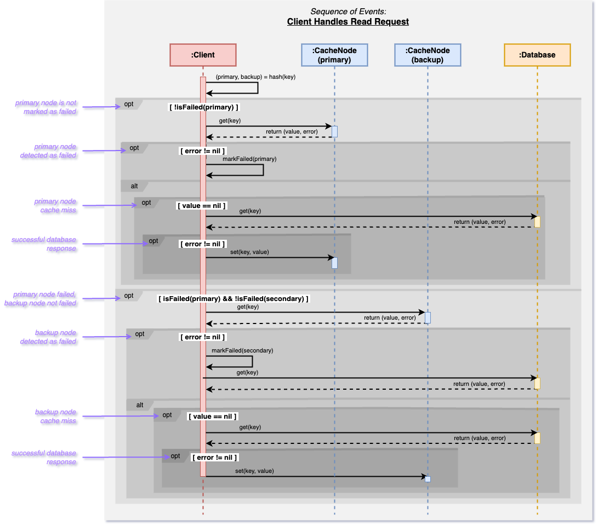

# A Study of Cache-Database Interactions

## Description

This project simulates a client-driven request distribution with multiple cache nodes that sit in front of a central database. Each data key is hashed on the client side to one of the cache nodes, and upon a cache miss, the request is redirected to the database. The presence of the distributed caching system reduces the load on the database and allows the system to handle many more requests per second than possible with the the database alone, as a large portion of read requests are fulfilled by the cache.

We aim to investigate how cache node failures impact system stability. Our proposed solution introduces a dual-layered hashing mechanism that assigns each key to both a primary and a secondary (backup) node, with a selective replication strategy among the cache nodes that prioritizes the synchronization of the top 1% of the "hottest" keys between each pair of primary and secondary nodes. By implementing this strategy, we aim to increase system robustness upon node failure by redirecting a significant portion of traffic from failed primary nodes to backup nodes enough to prevent failure of the database until the failed node recovers.

## Problem Statement

In distributed caching systems designed to handle a workload greater than the capacity of the underlying database, the failure of a cache node can cause a surge of requests to the database, creating a bottleneck effect for the other nodes who are prevented from acquiring fresh data upon a cache-miss. 

Given that these cache nodes depend on a small but continuous flow of data from the database, any interruption to this flow can diminish the cache system's overall hit rate. This exacerbates the situation by directing even more requests to the already overburdened database. This underscores a vulnerability in simple distributed caching systems, where the failure of an individual component can compromise the reliability of the entire system.

## Proposed Solution

We propose a mechanism where each key is hashed not only to a primary node but also to a backup node. Primary nodes are tasked with periodically updating backup nodes with the cached data of the top 1% of the most frequently accessed ("hottest") keys. This selective replication strategy is designed to ensure that in the event of a node failure, the system can redirect a significant proportion of requests to the corresponding backup node, at least enough to prevent the database from being overhwlmed until the failed node can recover. 

## System Configuration
- 5 servers - one for the database and four for cache instances.
- The database runs in its own container using 2 cores.
- Each cache instance uses 3 cores, totaling 12 cores for all cache instances.
- Aims for 90% of requests to be served by the cache and 10% by the database.

## Project Structure

The project consists of multiple modules, each with its own functionality:

- **Cache Node**: Manages caching operations (uses Memcache)
- **Database**: Manages database operations.
- **Benchmark**: Responsible for distributing requests between cache and database layers and uses Alibaba traces for performance analysis.

## (Old) Benchmarking with Trace Files
- Trace files are located in the `/usr/local/share/datasets/cmu-cache-datasets/alibabaBlock` directory on the `ccl5` remote host and are used by the benchmark module to simulate realistic workload patterns.
- The benchmark container will run on this remote host and will have the `alibabaBlock` directory mounted to `/app/traces` inside the Docker container.

## Simulating a Cache Failure
- Intentionally disable one cache instance to observe the effects on the database. The timing of the failure and recovery can be configured in the property file.
- Study the system's behavior when the cache instance is reinstated.

## Getting Started

### Installation

To build and run the Docker containers for each module, follow these steps:

#### Building the Docker Image

Navigate to the project root and build the Docker image for each module. For example, to build the benchmark module:

`docker build --platform=linux/amd64 -f benchmark/Dockerfile -t dockerusername/benchmark:benchmark .`

Repeat similar steps for the cache and database modules.

#### (Old) Running the Docker Container with Trace File Access

To run the benchmark module with access to the trace files, use the following command:

`docker run -v /usr/local/share/datasets/cmu-cache-datasets/alibabaBlock:/app/traces -it --rm dockerusername/benchmark:benchmark`

This command mounts the `alibabaBlock` directory containing the trace files into the container at `/app/traces`.

### Usage

- The benchmark module will process the trace files located in `/app/traces` inside the Docker container.
- Make sure the benchmark application logic refers to this path when accessing the trace files.

## Authors

- **Hannah Marsh** - _Initial work_ - [hrm1065](https://gitlab.cs.unh.edu/hrm1065)
